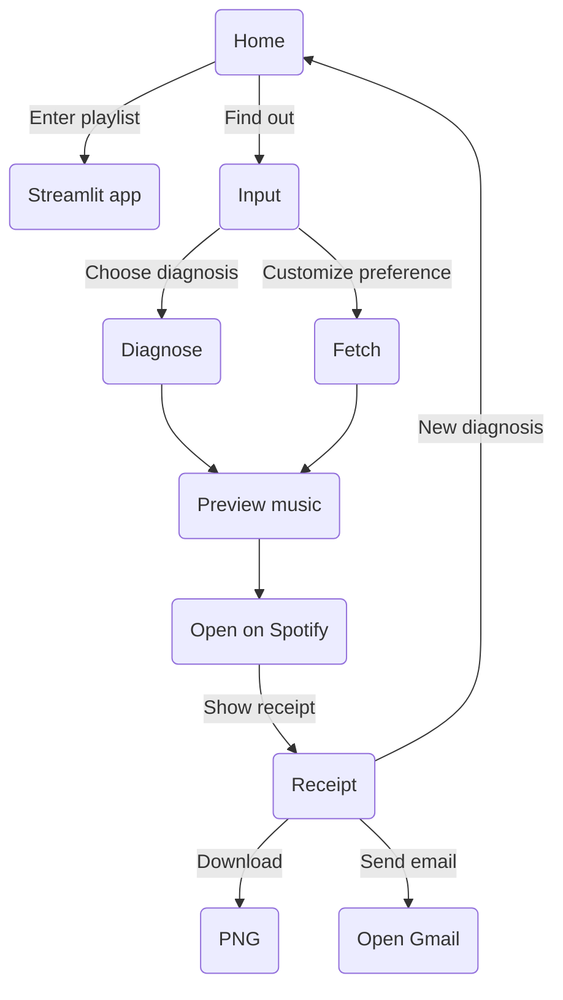

# Project demonstration

## General flow

## Allocation
**Ashton**: 
- Overview of the project. Indicate this is a `music taste analysis and recommendation` system
- Start from home introduce options
- Overview of input page

**Hilmy**:
- Execute `diagnosis`
- Overview of results: analysis, artists, songs, playlists
- Preview song on page
- Not mention open on Spotify yet

**Adam**:
- Demonstrate `receipt` component
- Download receipt
- Send email

**Quan**:
- Re-execute with customized preference
- Play music on Spotify 