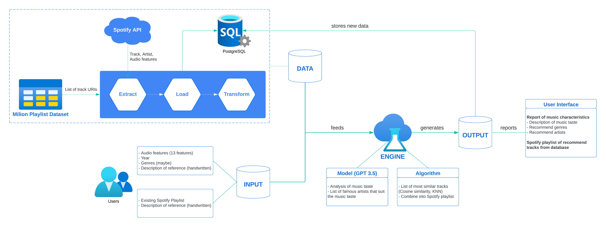

# Resonance - A tiny recommendation system

**Update** (15 December 2022): View the web application here at [Resonance](https://nauqh.github.io/error.html)

## About the project

In the contemporary era of digital music consumption, music enthusiasts have unparalleled access to a vast ocean of musical content. However, within these expansive collections, the need to discover the ideal tunes can be simultaneously delightful and difficult. 

Our project since then was initiated from a keen aspiration to directly address this challenge by contructing an innovative and efficient Music Recommendation System which leverages both existing data provided by music streaming platform and contemporary technology of recommender engine and large language models.

## Spotify Million Playlist Dataset
The foundation of the recommendation engine will hinge upon the [Spotify Million Playlist](https://www.aicrowd.com/challenges/spotify-million-playlist-dataset-challenge) dataset, a substantial corpus curated for the purpose of advancing research in music recommendations. Sampled from the over 4 billion public playlists on Spotify, this dataset of 1 million playlists consist of over 2 million unique tracks by nearly 300,000 artists, and represents the largest public dataset of music playlists in the world. The dataset includes public playlists created by US Spotify users between January 2010 and November 2017. 

The challenge ran from January to July 2018, and received 1,467 submissions from 410 teams. A summary of the challenge and the top scoring submissions was published in the [ACM Transactions on Intelligent Systems and Technology](https://dl.acm.org/doi/abs/10.1145/3344257).

## Data Management

The project's primary focus is on refining the Spotify Million Playlist Dataset by employing a meticulous data cleaning process to extract approximately 600,000 unique track identifiers (URIs). These URIs serve as the foundation for interfacing with the Spotify API to retrieve both audio characteristics and associated metadata for each track, enabling the development of a recommendation system tailored to individual user preferences. 

In our project, we have opted not to employ the complete original dataset for training the recommendation engine due to limitations and inconsistencies in the JSON format. As a result, we have devised a comprehensive solution for creating a customized dataset, leveraging the Million Playlist Dataset as its core. This process involves the initial extraction of all song URLs, followed by a thorough data aggregation and cleaning process aimed at isolating unique URIs and eliminating any duplications.