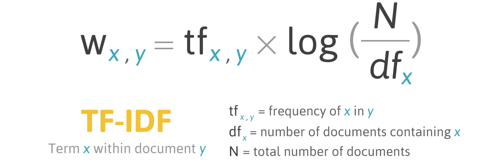

# Resonance - A tiny recommendation system

**Update** (15 December 2022): View the web application here at [Resonance](https://nauqh.github.io/error.html)

## About the project

In the contemporary era of digital music consumption, music enthusiasts have unparalleled access to a vast ocean of musical content. However, within these expansive collections, the need to discover the ideal tunes can be simultaneously delightful and difficult. 

Our project since then was initiated from a keen aspiration to directly address this challenge by contructing an innovative and efficient Music Recommendation System which leverages both existing data provided by music streaming platform and contemporary technology of recommender engine and large language models.

## Spotify Million Playlist Dataset
The foundation of the recommendation engine will hinge upon the [Spotify Million Playlist](https://www.aicrowd.com/challenges/spotify-million-playlist-dataset-challenge) dataset, a substantial corpus curated for the purpose of advancing research in music recommendations. Sampled from the over 4 billion public playlists on Spotify, this dataset of 1 million playlists consist of over 2 million unique tracks by nearly 300,000 artists, and represents the largest public dataset of music playlists in the world. The dataset includes public playlists created by US Spotify users between January 2010 and November 2017. 

The challenge ran from January to July 2018, and received 1,467 submissions from 410 teams. A summary of the challenge and the top scoring submissions was published in the [ACM Transactions on Intelligent Systems and Technology](https://dl.acm.org/doi/abs/10.1145/3344257).

## Data Management

### 1. Extraction

Our project revolves around refining the Spotify Million Playlist Dataset. We achieve this by meticulously cleaning the data, resulting in approximately 600,000 unique track identifiers (URIs). These URIs form the bedrock for interfacing with the Spotify API, allowing us to retrieve both audio characteristics and associated metadata for each track. This, in turn, enables us to develop a recommendation system finely tuned to individual user preferences.

Rather than utilizing the complete original dataset for training our recommendation engine, we've chosen a different approach due to limitations and inconsistencies in the JSON format. Instead, we've crafted a comprehensive solution that revolves around creating a customized dataset, with the Million Playlist Dataset at its core. This process involves the initial extraction of all song URLs, followed by a meticulous data aggregation and cleaning process. The goal here is to isolate unique URIs while eliminating any duplications.

Through this meticulous approach, we gather essential audio features and pertinent song metadata, which includes artist and album details. This carefully curated dataset will serve as the cornerstone of our recommendation engine, ensuring that users receive highly relevant results through our interface. 

Additional details about the data can be accessed via the [Spotify Developer](https://developer.spotify.com/documentation/web-api) platform. The code for the extraction process can be found in the associated [repository](https://github.com/nauqh/Resonance).

### 2. Storage 

Following the extraction process, the acquired data will be subsequently loaded into a centralized database for further processing, which includes transformation into a machine-readable format. As outlined in the preceding section, the data obtained from the Spotify API comprises three primary categories:
- **Artist data** encompasses comprehensive information pertaining to the performing artist, including but not limited to genres, popularity, images, and external urls.
- **Song metadata** contains a diverse set of attributes related to the song, encompassing details such as genres, album information, release date, and popularity.
- **Audio features** encapsulates audio-related metrics for a given song, encompassing factors such as valence, danceability, mode, loudness, and instrumentalness.

### 3. Transformation

A critical aspect of preprocessing techniques employed in this procedure centers on two fundamental tasks: the normalization of numeric data and the computation of term frequencies for categorical data.

#### Data normalization

In the context of recommendation systems, data normalization plays a crucial role in ensuring that relevant variables are consistently scaled, thereby facilitating precise computations. Specifically, in the case of numeric audio features data, normalization is imperative to establish a uniform basis for comparisons and to prevent potential distortions in recommendation outcomes. To this end, we have harnessed the capabilities of the **MinMaxScaler()** function from the scikit-learn library, a highly potent tool adept at automatically standardizing values within a defined range of 0 to 1. 

#### Categorical data encoding

TF-IDF, also known as [Term Frequency-Inverse Document Frequency](https://en.wikipedia.org/wiki/Tf%E2%80%93idf), is a tool to quantify words in a set of documents. The goal of TF-IDF is to show the importance of a word in the documents and the corpus. The general formula for calculating TF-IDF score is:

The motivation is to find words that are not only important in each document but also accounting for the entire corpus. The log value was taken to decrease the impact of a large N, which would lead to a very large IDF compared to TF. Term Frequency (TF) focuses on how crucial a word is within one document, while Inverse Document Frequency (IDF) looks at how important a word is across all the documents.
