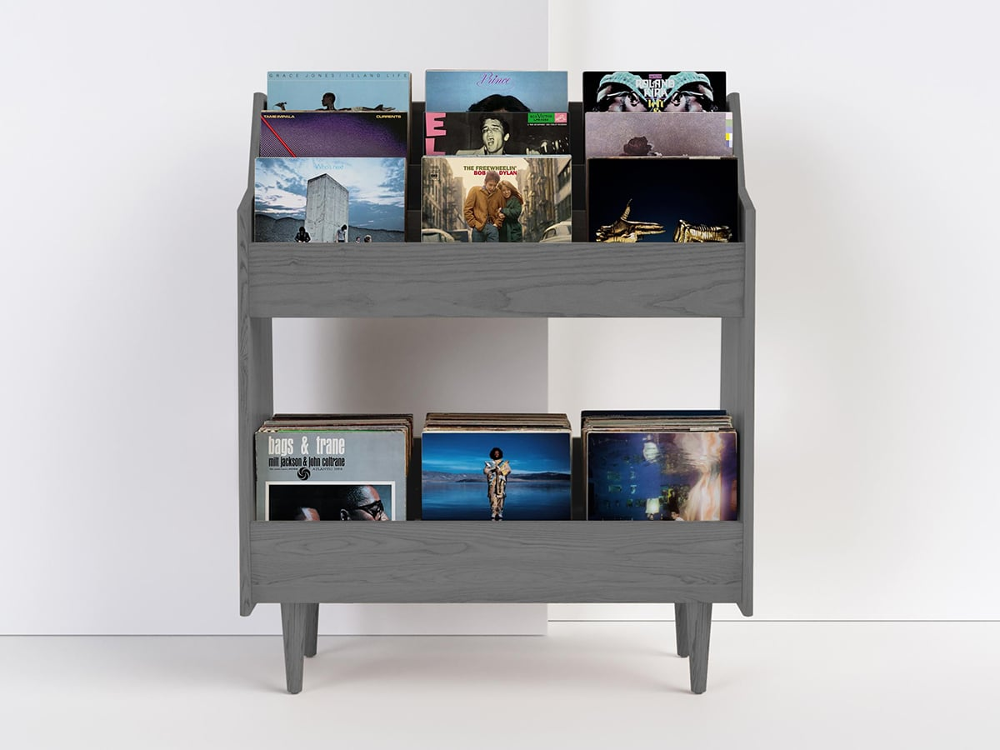

# Resonance - A tiny recommendation system

**Update** (15 December 2022): View the web application here at [Resonance](https://resonances.streamlit.app/)

## About the project

In the contemporary era of digital music consumption, music enthusiasts are presented with an abundance of musical content. However, within this expansive repository, the task of discovering the optimal tunes has been proved to be both gratifying and challenging. 

Our project since then was initiated with a dedicated commitment to directly address this challenge with the aim of constructing an innovative and effective Music Recommendation System which harnesses the combination of pre-existing data provided by music streaming platforms and temporary technologies encompassing recommender engines and state-of-the-art large language models.

## Spotify Million Playlist Dataset
The foundation of the recommendation engine will hinge upon the [Spotify Million Playlist](https://www.aicrowd.com/challenges/spotify-million-playlist-dataset-challenge) dataset, a substantial corpus curated for the purpose of advancing research in music recommendations. Sampled from the over 4 billion public playlists on Spotify, this dataset of 1 million playlists consist of over 2 million unique tracks by nearly 300,000 artists, and represents the largest public dataset of music playlists in the world. The dataset includes public playlists created by US Spotify users between January 2010 and November 2017. 

The challenge ran from January to July 2018, and received 1,467 submissions from 410 teams. A summary of the challenge and the top scoring submissions was published in the [ACM Transactions on Intelligent Systems and Technology](https://dl.acm.org/doi/abs/10.1145/3344257).